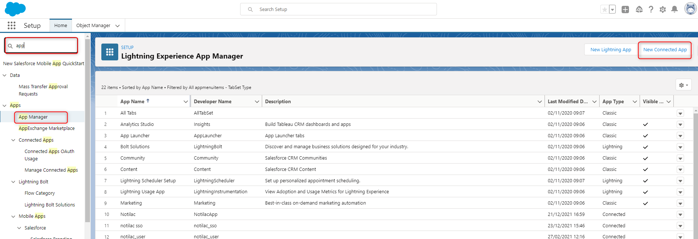
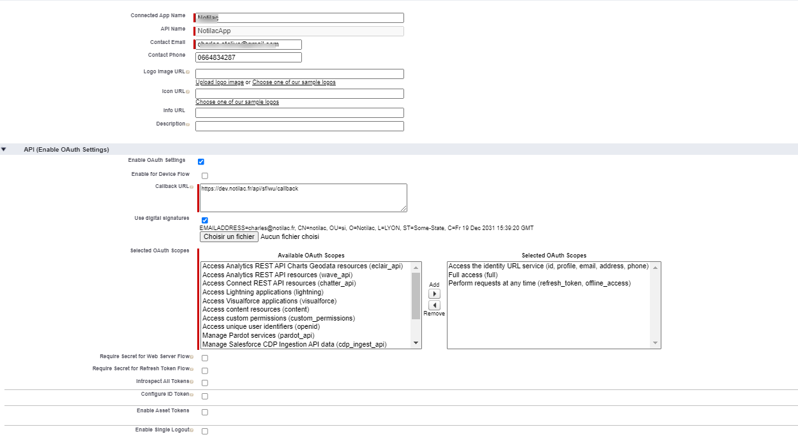
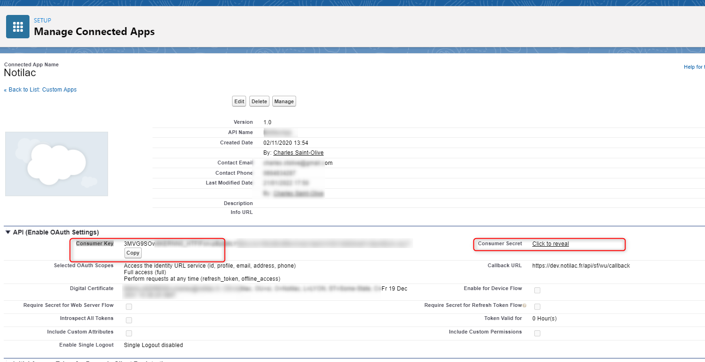
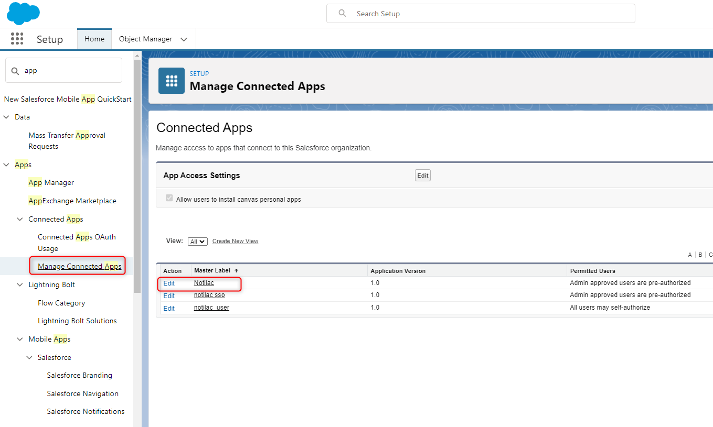
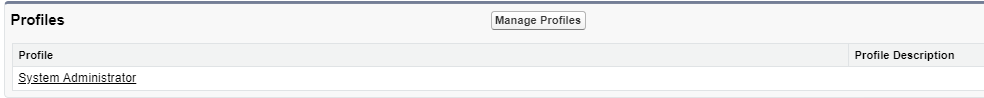
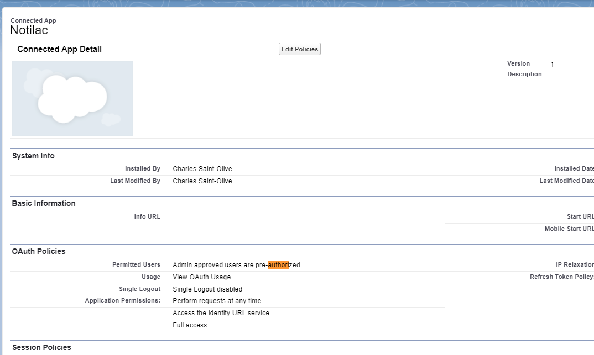
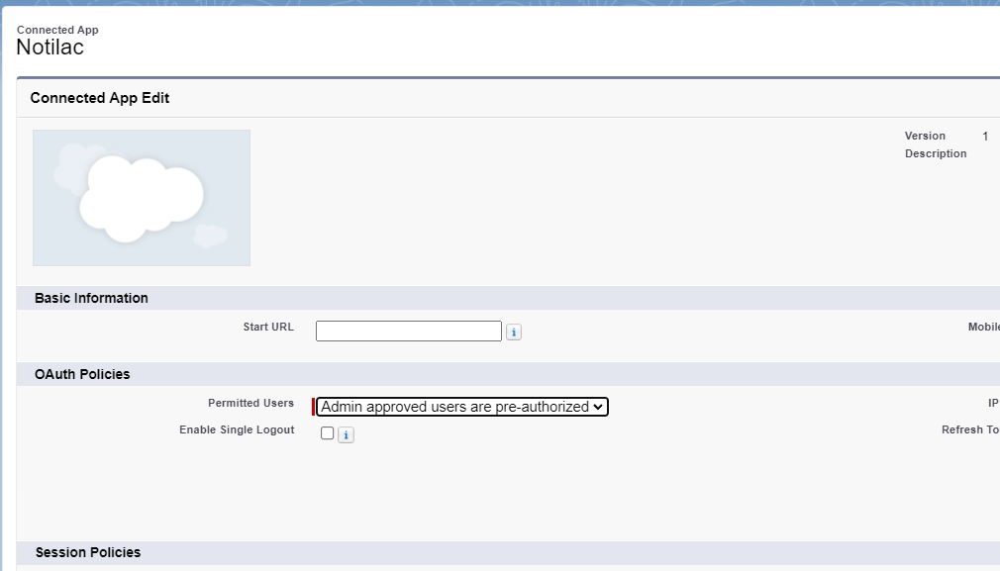
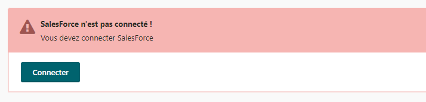
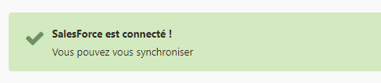

# Installation et paramétrage de salesforce

Je vous consil de basculer temporeirement en anglais afin d'avoir le même langage qu'ici. J'ai pris l'habitude de toujours configurer les apps en anglais puisque un maximum de tuto est en anglais. 

##Instalation JWT
Commencez par entrez les informations suivantes. 
```
SF_AUTH_METHOD = OAuthJWT
SF_LOGIN_URL = https://login.salesforce.com/
# For sandbox: SF_LOGIN_URL=https://test.salesforce.com
SF_USERNAME = { USERNAME de l'utilisateur principal} 
```
### Créez une clef et un certificat à la racine du serveur en entrant la commande suivante :
```
openssl genrsa -out privatekey.pem 1024
openssl req -new -x509 -key privatekey.pem -out publickey.cer -days 3650
```
### Allez sur Salesforce
Entrez 'App' dans la recherche de la config, selectionez **App Manager**, puis **New Connected App**


* App name : un nom de votre choix
* Api name : un nom de votre choix
* Email : Votre email de dev
* Enable OAuth Settings : yes
* CallbackUrl: {ledomainedelapp}/api/sf/wu/callback
* Use digital signature : yes
* Uploader le cetificat : publickey.cer
* Dnas les selectz 0Auth:
  * Au  minimum : Perform requests at any time ( refresj_token, offline_access)




#### Après avoir sauvegardé l'app
Vous êtes sur la page de setup de l'app

VOus récuperez ici : 
```
SF_CONSUMER_KEY = {la valeur sur la page}
SF_CONSUMER_SECRET = {la valeur sur la page, cliquez pour découvrir le code}
SF_CALLBACK_URI = {le code au format {ledomainedelapp}/api/sf/wu/callback}
```
#### Authoriser l'utilisateur
1. Cliquez sur Manage Connected Apps 
   


2. Cliquez sur Manage permissions sets et ajoutez le profil concerné par l'app 
   


3. Cliquez sur edit policies 
  

4. Choisir pre-authorized 
   


#### Verifier si la config est OK
Rendez vous sur la page gestion des logs de votre application. 



Cliquer sur connecter. 




Une confirmation de connextion devrait apparaitre.

> Il n'éxiste pas de gestion des erreurs, je vous invite à verifier les logs si la connexion ne marche pas.